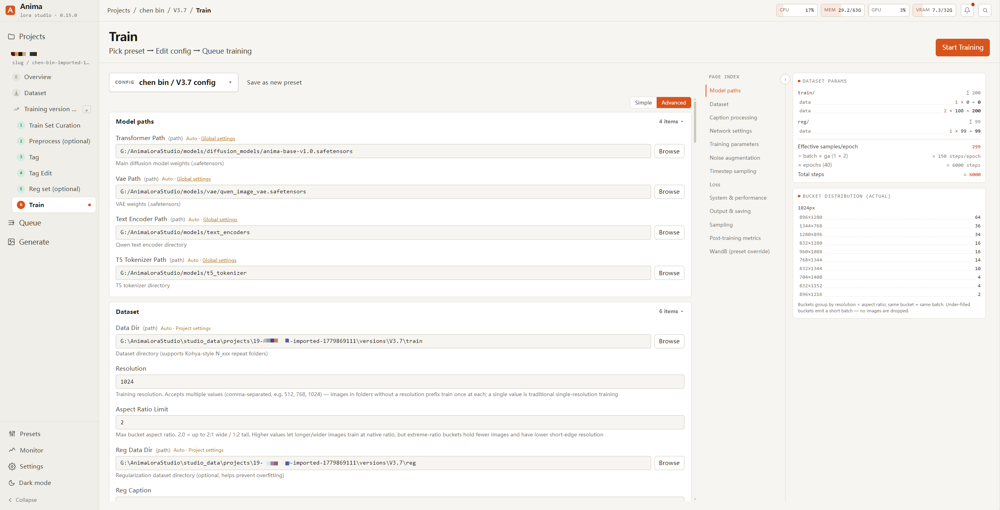

# AnimaLoraStudio

[](README.md) [](README.en.md) [](CHANGELOG.md) [](LICENSE)

**End-to-end pipeline**: Booru scraping → curation → tagging → regularization set → training → image-gen testing, all in one browser panel. Trains LoRAs for two model families: [Anima](https://huggingface.co/circlestone-labs/Anima) (Cosmos DiT, anime-specialized, lightweight) and [Krea 2](https://huggingface.co/krea/Krea-2-Raw) (12.9B single-stream MMDiT; train on Raw, test fast on Turbo).



## Features

- **One-stop pipeline**: Booru scraping / curation / preprocessing (dedup · upscale · crop · retouch) / tagging / regularization set / training / image-gen testing — all in one browser panel, guided by a stepper.
- **Two model families**: Anima and Krea 2 share the same workflow; switch families right in the training config (weight paths and family defaults are recomputed with an itemized confirmation), options are filtered per family, and one project can hold versions of both families.
- **Three taggers**: WD14, CLTagger (local ONNX), LLM (OpenAI-compatible, long captions); a trigger word entered once is auto-injected into every caption and sample image.
- **Booru scraping**: native Gelbooru / Danbooru (Cloudflare-compatible UA, rate limiting, account auth).
- **Automatic regularization sets**: reverse-search by your training set's tag distribution + aspect-ratio clustering, or AI priors from the base model (no LoRA needed).
- **Project / Version two-tier management**: one project holds multiple versions sharing downloaded data, with independent config / output; presets fork both ways with the global pool.
- **Multi-task queue**: training, generation and data jobs in one unified ledger; enqueue, scheduled start, pause (resume from the last epoch boundary), resume, and queue-level hold.
- **Built-in image-gen testing**: single-image / XY-grid eval + a resident inference daemon; fp8 base-model inference and LoRA merge are bit-for-bit aligned with ComfyUI; community LoRAs in PEFT / comfy key format (the civitai ecosystem) load directly; output `lora_unet_*` drops straight into ComfyUI, no conversion.
- **fp8 & VRAM orchestration**: official fp8 weights work as both training base models (fp8_base — Krea 2 training reaches down to 24 GB-class GPUs) and inference base models (weight VRAM roughly halved); per-task prompt pre-encoding with text-encoder release, a three-level VRAM policy, and a RAM guard for large-weight loading.
- **Rich training algorithms**: multiple loss / timestep sampling / optimizers (AdamW · Lion · Prodigy · SOAP, etc.) / LoRA · LyCORIS adapters — see [Training algorithm options](docs/user-guide/training-tips.md#训练算法选项).
- **Self-healing setup + in-app self-update**: GPU-aware torch on first install, dependency hash checks, git pull / restart / rollback.
- **Bilingual**: pick a language on first launch, switchable in Settings.

> The training core (`runtime/`) is decoupled from the Studio backend and runs standalone via CLI; model families and adapters / optimizers / schedulers / losses / samplers / timestep sampling are all extensible plugin registries (see [ADR 0003](docs/adr/0003-anima-train-refactor.md)).

## Quick start

**Prerequisites** (install yourself): NVIDIA GPU + CUDA · Python 3.10+ · Node.js 18+ · Git.

```bash
git clone https://github.com/WalkingMeatAxolotl/AnimaLoraStudio
cd AnimaLoraStudio
studio.bat          # Windows
./studio.sh         # Linux / macOS
```

First run automatically creates `venv/` → installs GPU-matched CUDA torch → builds the frontend → starts the backend → opens <http://127.0.0.1:8765/>, with an onboarding modal to one-click install the Anima starter set. Once open, go to the model download center under **Settings → Training** and download the weights for your model family (defaults to `./models/`).

→ Full walkthrough (launch options / model download / mirrors / pipeline steps): see the **[Getting Started guide](docs/user-guide/getting-started.en.md)**.

## Hardware requirements

- **GPU**: NVIDIA (AMD / Apple Silicon not supported), per family:
  - **Anima**: **16 GB+ VRAM recommended** (RTX 4060Ti 16G / 4070Ti / 4080 / 3090 / 4090 / 5090, etc.); **8 GB barely works** (turn off sample output + reduce batch / resolution; noticeably slower).
  - **Krea 2** (12.9B): **training** runs on 24 GB-class GPUs with the official fp8 base model, or 32 GB for bf16; **generation** with an fp8 base runs from 16 GB (on the "save VRAM" policy), bf16 bases want 32 GB.
- **RAM**: 16 GB+; 32 GB+ recommended for Krea 2 (loading a 26.3 GB single-file checkpoint peaks at roughly file size in RAM)
- **Storage**: SSD strongly recommended (frequent latent-cache + sample IO); budget disk space for Krea 2 weights (Raw / Turbo bf16 26.3 GB each, official fp8 13.1 GB each, text encoder 5.2–8.9 GB)

## Documentation

Entry point: [docs/README.md](docs/README.md).

- **Getting started** → [getting-started.md](docs/user-guide/getting-started.en.md)
- **User guide** → [tag format](docs/user-guide/tagging-guide.md) · [training tips / algorithms](docs/user-guide/training-tips.md) · [optimizers](docs/user-guide/optimizers.md) · [caption format](docs/user-guide/caption-format.md)
- **Architecture** → [pipeline overview](docs/architecture/studio-pipeline.md) · [project structure](docs/architecture/project-structure.en.md) · [studio internals](studio/README.md)
- **CLI tools** → [tools/README.md](tools/README.md)
- **Contributing** → [CONTRIBUTING.md](CONTRIBUTING.md) · [docs/AGENTS.md](docs/AGENTS.md)
- **Decision records** → [docs/adr/](docs/adr/) · **Changelog** → [CHANGELOG.md](CHANGELOG.md)

## Upstream and credits

- Core training scripts derived from [**Moeblack/AnimaLoraToolkit**](https://github.com/Moeblack/AnimaLoraToolkit)
- Anima base model / VAE: [circlestone-labs / Anima](https://huggingface.co/circlestone-labs/Anima)
- Krea 2 base models: [krea / Krea-2-Raw](https://huggingface.co/krea/Krea-2-Raw) · [Krea-2-Turbo](https://huggingface.co/krea/Krea-2-Turbo) (official fp8 quantizations from [Comfy-Org/Krea-2](https://huggingface.co/Comfy-Org/Krea-2))
- Text encoders: [Qwen3-0.6B-Base](https://huggingface.co/Qwen/Qwen3-0.6B-Base) (Anima) and [Qwen3-VL-4B-Instruct](https://huggingface.co/Qwen/Qwen3-VL-4B-Instruct) (Krea 2), by the Qwen team
- Krea 2 training / sampling implementation references and partially derives from [**kohya-ss/musubi-tuner**](https://github.com/kohya-ss/musubi-tuner) (Apache-2.0); model structure derives from ComfyUI, cross-checked against [HuggingFace diffusers](https://github.com/huggingface/diffusers)
- OrthoLoRA / T-LoRA adapters derived from [**sorryhyun/anima_lora**](https://github.com/sorryhyun/anima_lora) (MIT); algorithm from the [ControlGenAI/T-LoRA](https://github.com/ControlGenAI/T-LoRA) paper and official implementation
- Automagic optimizer ported from [**ostris/ai-toolkit**](https://github.com/ostris/ai-toolkit) (MIT); bf16 Kahan path references [tdrussell/diffusion-pipe](https://github.com/tdrussell/diffusion-pipe)
- Image-gen / sampling path aligned with and derived from [**ComfyUI**](https://github.com/comfyanonymous/ComfyUI) (GPL-3.0)

Full third-party algorithm / code / paper attribution: see [`THIRD_PARTY_NOTICES.md`](THIRD_PARTY_NOTICES.md).

## License

Released under **GPL-3.0** overall (includes / derives from ComfyUI's GPL-3.0 code). It also bundles some Apache-2.0 third-party implementations (NVIDIA Cosmos / Wan2.1 / musubi-tuner derivations, etc.) — see `LICENSE` (GPL-3.0) / `LICENSE-APACHE` / [`THIRD_PARTY_NOTICES.md`](THIRD_PARTY_NOTICES.md); please keep the original file headers.

**Model weights** (Anima / Krea 2 / Qwen / VAE) have their own terms: Anima-related weights carry Non-Commercial restrictions; Krea 2 weights are governed by the [Krea 2 Community License](https://huggingface.co/krea/Krea-2-Raw/blob/main/LICENSE.pdf). Defer to each model card / HF repo license.
