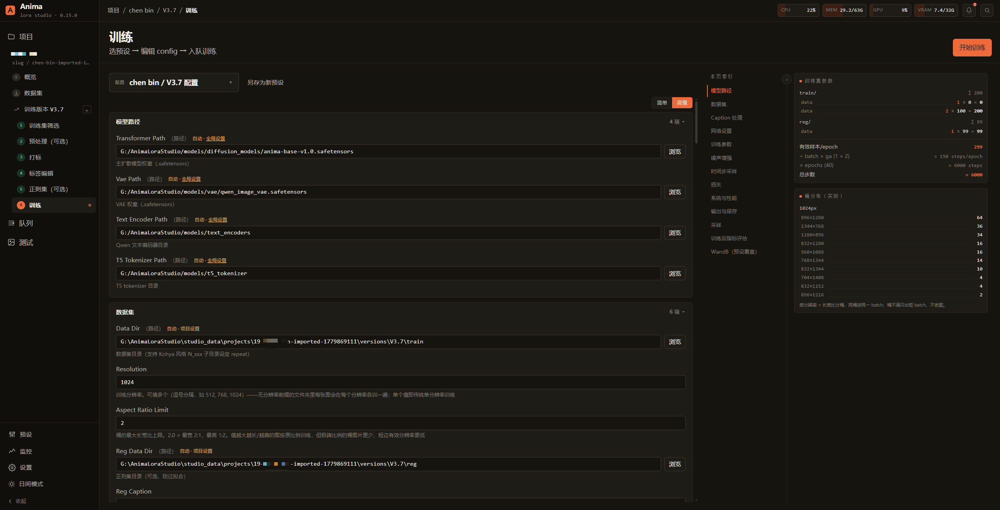

# AnimaLoraStudio

[](README.md) [](README.en.md) [](CHANGELOG.md) [](LICENSE)

**端到端流水线**：从 Booru 抓图 → 筛选 → 打标 → 正则集 → 训练 → 出图测试，全流程在一个浏览器面板里推进。专为 [Anima](https://huggingface.co/circlestone-labs/Anima)（Cosmos DiT 二次元特调）训练优化。



## 特性

- **一站式流水线**：Booru 抓图 / 筛选 / 预处理（去重·放大·裁剪）/ 打标 / 正则集 / 训练 / 出图测试，全在一个浏览器面板，Stepper 引导。
- **三种打标器**：WD14、CLTagger（本地 ONNX）、LLM（OpenAI 兼容，长 caption）；触发词填一次自动注入每张 caption 与采样图。
- **Booru 抓图集成**：原生 Gelbooru / Danbooru（Cloudflare 兼容 UA、速率限制、账号认证）。
- **正则集自动生成**：训练集 tag 分布反向搜 + 长宽比聚类，或底模 AI 先验出图（无需 LoRA）。
- **Project / Version 双层管理**：单项目多 version 共享数据、独立配置 / 输出；预设池双向 fork。
- **多任务队列**：排队、暂停（从最近 epoch 末续）、恢复、队列调度挂起。
- **内置出图测试**：单图 / XY 矩阵评测 + 常驻推理 daemon；输出 `lora_unet_*` 直接拖进 ComfyUI、无需转换。
- **丰富训练算法**：多种 loss / timestep 采样 / 优化器（AdamW · Lion · Prodigy · SOAP 等）/ LoRA · LyCORIS adapter，详见 [训练算法选项](docs/user-guide/training-tips.md#训练算法选项)。
- **环境自愈 + Web 内自更新**：首装自动选 GPU 兼容 torch、依赖哈希比对、git pull / 重启 / 回滚。
- **中英双语**：首次启动选语言，Settings 内可切换。

> 训练核心（`runtime/`）与 Studio 后端解耦，可独立 CLI 跑；adapter / optimizer / scheduler / loss / sampler 五个 plugin registry 可扩展（见 [ADR 0003](docs/adr/0003-anima-train-refactor.md)）。

## 快速开始

**先决条件**（需自备）：NVIDIA GPU + CUDA（16 GB+ 显存推荐，8 GB 极限可跑）· Python 3.10+ · Node.js 18+ · Git。

```bash
git clone https://github.com/WalkingMeatAxolotl/AnimaLoraStudio
cd AnimaLoraStudio
studio.bat          # Windows
./studio.sh         # Linux / macOS
```

首次运行自动建 `venv/` → 按 GPU 驱动装对应 CUDA torch → 构建前端 → 起后端 → 开浏览器到 <http://127.0.0.1:8765/>，并弹引导 modal 一键装模型。打开后去 **Settings → Models** 一键下载权重（默认落 `./models/`）。

→ 完整步骤（启动选项 / 模型下载 / 国内镜像 / 流水线 walkthrough）见 **[上手教程](docs/user-guide/getting-started.md)**。

## 硬件要求

- **GPU**：NVIDIA，**16 GB+ 显存推荐**（RTX 4060Ti 16G / 4070Ti / 4080 / 3090 / 4090 / 5090 等）；**8 GB 极限可跑**（需关 sample 输出 + 减小 batch / 分辨率，速度明显下降）。A 卡 / Apple Silicon 不支持。
- **RAM**：16 GB+
- **存储**：SSD 强烈推荐（latent cache + sample 输出 IO 频繁）

## 文档

总入口 [docs/README.md](docs/README.md)。

- **上手** → [getting-started.md](docs/user-guide/getting-started.md)
- **用户向** → [标签格式](docs/user-guide/tagging-guide.md) · [训练技巧 / 算法](docs/user-guide/training-tips.md) · [优化器](docs/user-guide/optimizers.md) · [caption 格式](docs/user-guide/caption-format.md)
- **架构** → [跨步骤总览](docs/architecture/studio-pipeline.md) · [项目结构](docs/architecture/project-structure.md) · [studio 内部](studio/README.md)
- **CLI 工具** → [tools/README.md](tools/README.md)
- **协作** → [CONTRIBUTING.md](CONTRIBUTING.md) · [docs/AGENTS.md](docs/AGENTS.md)
- **决策记录** → [docs/adr/](docs/adr/) ·　**变更历史** → [CHANGELOG.md](CHANGELOG.md)

## 上游与致谢

- 核心训练脚本派生自 [**Moeblack/AnimaLoraToolkit**](https://github.com/Moeblack/AnimaLoraToolkit)
- 主模型 / VAE：[circlestone-labs / Anima](https://huggingface.co/circlestone-labs/Anima)
- OrthoLoRA / T-LoRA 适配器实现派生自 [**sorryhyun/anima_lora**](https://github.com/sorryhyun/anima_lora)（MIT），算法出自 [ControlGenAI/T-LoRA](https://github.com/ControlGenAI/T-LoRA) 论文与官方实现
- Automagic 优化器移植自 [**ostris/ai-toolkit**](https://github.com/ostris/ai-toolkit)（MIT），bf16 Kahan 路径参考 [tdrussell/diffusion-pipe](https://github.com/tdrussell/diffusion-pipe)
- 测试出图 / 采样链路对齐并派生自 [**ComfyUI**](https://github.com/comfyanonymous/ComfyUI)（GPL-3.0）

完整的第三方算法 / 代码 / 论文出处见 [`THIRD_PARTY_NOTICES.md`](THIRD_PARTY_NOTICES.md)。

## License

仓库整体以 **GPL-3.0** 发布（包含 / 派生自 ComfyUI 的 GPL-3.0 代码）。同时包含部分 Apache-2.0 第三方实现（NVIDIA Cosmos / Wan2.1 等），见 `LICENSE`（GPL-3.0）/ `LICENSE-APACHE` / [`THIRD_PARTY_NOTICES.md`](THIRD_PARTY_NOTICES.md)，请保留原文件头声明。

**模型权重**（Anima / Qwen / VAE）有各自的条款（含 Non-Commercial 等限制），请以对应模型卡 / HF repo 协议为准。
